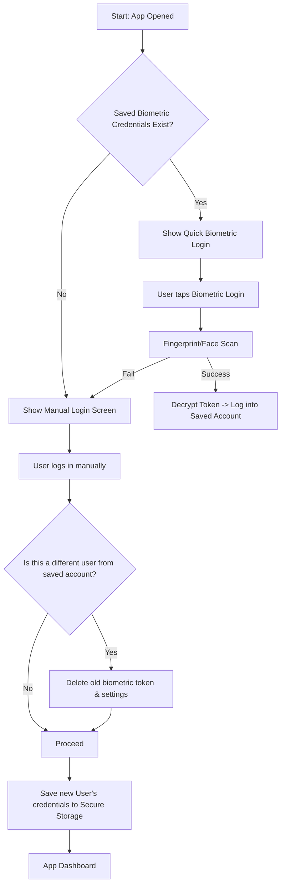

# Premium Biometric Authentication App

A Flutter application demonstrating standard biometric authentication (Fingerprint / Face ID) patterns, featuring "Remember Me" (Soft Logout) and account removal (Hard Logout) capabilities.

## Architecture & Authentication Flows

### Biometric Flow (Multi-User Single-Device Handling)

Since mobile operating systems (iOS Secure Enclave & Android Keystore) verify whether the *device owner* has authenticated but do not identify *which* specific user is logging in, this application implements a standard single-active-biometric pattern. 

Only the **last user who logged in and enabled biometrics** can log in via biometric authentication. Logging in with a different account automatically wipes the previously stored biometric configuration to ensure security.

---

### Scenario 1: User A enables biometrics, User B logs in manually (does not enable biometrics)

| Step | Action | Secure Storage State | Login Screen Behavior |
| :--- | :--- | :--- | :--- |
| **1** | **User A** logs in and enables biometrics. | `savedUsername` = `"User A"` `biometricEnabled` = `true` `token` = `"token_A"` | — |
| **2** | **User A** logs out (Soft Logout). | `savedUsername` = `"User A"` `biometricEnabled` = `true` `token` = `"token_A"` | **Quick Biometric Sign-In** button is visible. |
| **3** | **User B** logs in manually. | `savedUsername` = `"User B"` `biometricEnabled` = `false` `token` = `null` | Previous biometric setup for User A is deleted on detection of a different user. |
| **4** | **User B** logs out (Soft Logout). | `savedUsername` = `"User B"` `biometricEnabled` = `false` `token` = `null` | **Quick Biometric Sign-In** button is hidden. |

---

### Scenario 2: Both User A and User B enable biometrics

| Step | Action | Secure Storage State | Login Screen Behavior |
| :--- | :--- | :--- | :--- |
| **1** | **User A** logs in and enables biometrics. | `savedUsername` = `"User A"` `biometricEnabled` = `true` `token` = `"token_A"` | — |
| **2** | **User A** logs out (Soft Logout). | `savedUsername` = `"User A"` `biometricEnabled` = `true` `token` = `"token_A"` | **Quick Biometric Sign-In** button is visible. |
| **3** | **User B** logs in manually. | `savedUsername` = `"User B"` `biometricEnabled` = `false` `token` = `null` | User A's configurations are cleared. |
| **4** | **User B** enables biometrics in settings. | `savedUsername` = `"User B"` `biometricEnabled` = `true` `token` = `"token_B"` | — |
| **5** | **User B** logs out (Soft Logout). | `savedUsername` = `"User B"` `biometricEnabled` = `true` `token` = `"token_B"` | **Quick Biometric Sign-In** button is visible for **User B**. |

---

## Soft Logout vs. Hard Logout

1. **Soft Logout (Logout)**
   - Triggered via the **Logout** button.
   - Clears the active in-memory session.
   - Retains the token, username, and biometric configuration in Secure Storage.
   - Allows the user to quickly log back in with biometrics on the login page.

2. **Hard Logout (Remove Account)**
   - Triggered via the **Remove Account from Device** (or **Forget Saved Account**) button.
   - Completely deletes all credentials from Secure Storage.
   - Disables biometric sign-in so that the next user must input their email/password manually.
