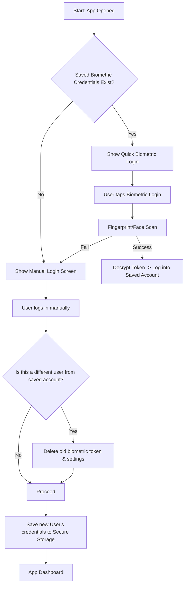
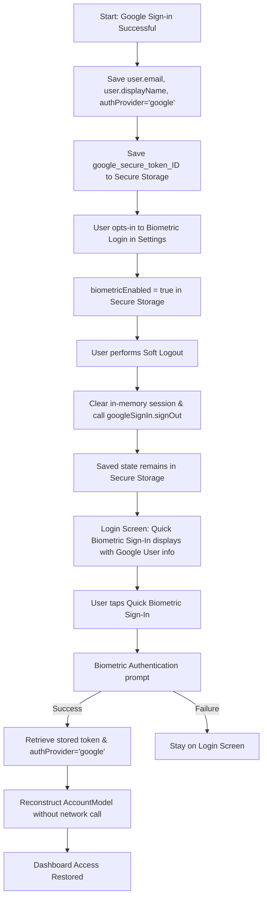

# Premium Biometric Authentication App

A Flutter application demonstrating standard biometric authentication (Fingerprint / Face ID) patterns, featuring "Remember Me" (Soft Logout) and account removal (Hard Logout) capabilities.

---

## 📱 Try the App
You can download and install the latest working version of the app directly on your Android device:

[](https://github.com/ArpitAswal/Biometric-Authentication-Secure-Flow/releases/download/v1.0.0/app-release.apk)

---

## ⚙️ Google Sign-In Setup (Required before running)

Google Sign-In requires a `google-services.json` file that links your Android app to a Firebase project. This file contains your API keys and client IDs, etc.
### Step 1 — Create a Firebase project

1. Go to [https://console.firebase.google.com](https://console.firebase.google.com) and create (or open) a project.
2. Click **Add app → Android**.
3. Enter the **Android package name**: `com.example.biomteric_signin`
   *(This must match `applicationId` in `android/app/build.gradle.kts`)*
4. Enter a **debug SHA-1 fingerprint** (see Step 2 below).
5. Download the generated `google-services.json`.

### Step 2 — Get your debug SHA-1 fingerprint

Run this command in your terminal:

```bash
keytool -list -v -keystore ~/.android/debug.keystore -alias androiddebugkey -storepass android -keypass android
```

Copy the `SHA1` value and paste it into the Firebase console during app registration.

### Step 3 — Place google-services.json

Copy the downloaded file into:

```
android/app/google-services.json   ← place it here
android/app/google-services.json.example  ← this is the safe template (already committed)
```


### Step 4 — Enable Google Sign-In in Firebase

1. In the Firebase console, go to **Authentication → Sign-in method**.
2. Enable **Google** as a sign-in provider and save.

### Step 5 — For teammates / CI (keeping secrets out of GitHub)

Because `google-services.json` is gitignored, your teammates need to generate their own. There are two common approaches:

| Approach | How |
|:---|:---|
| **Manual** | Each developer follows Steps 1-3 above and downloads their own copy. |
| **CI/CD Secret** | Store the file content as a base64-encoded secret in GitHub Actions / Bitrise, then decode it during the build step. |

For GitHub Actions, add this to your workflow:

```yaml
- name: Decode google-services.json
  run: echo "${{ secrets.GOOGLE_SERVICES_JSON }}" | base64 --decode > android/app/google-services.json
```

### Step 6 — Secure Web Client ID Configuration (Keeping Web Client ID Private)

On Android, the `google_sign_in` package requires an explicit `serverClientId` (which corresponds to your Google Web Client ID) during initialization. To prevent committing this credential to a public GitHub repository, the app reads it at compile time from the environment variable `GOOGLE_WEB_CLIENT_ID` via `String.fromEnvironment`.

Here are three ways to supply this ID:

#### Option A: Using `secrets.json` (Recommended for Local Dev)
1. Copy [secrets.json.example](file:///Users/arpit/StudioProjects/biomteric_signin/secrets.json.example) to `secrets.json` in the project root:
   ```json
   {
     "GOOGLE_WEB_CLIENT_ID": "YOUR_WEB_CLIENT_ID_HERE"
   }
   ```
   *(Note: `secrets.json` is already gitignored, so it won't be pushed to Git.)*

2. Run or build the app by passing the `--dart-define-from-file` flag:
   ```bash
   flutter run --dart-define-from-file=secrets.json
   ```

#### Option B: Inline CLI Argument
Directly pass it as a `--dart-define` key-value pair in your command-line terminal:
```bash
flutter run --dart-define=GOOGLE_WEB_CLIENT_ID=YOUR_WEB_CLIENT_ID_HERE
```

#### Option C: IDE Run Configurations
- **VS Code**: Create a `.vscode/launch.json` file in the project root and add the argument to `toolArgs`:
  ```json
  {
    "version": "0.2.0",
    "configurations": [
      {
        "name": "biomteric_signin",
        "request": "launch",
        "type": "dart",
        "toolArgs": [
          "--dart-define-from-file",
          "secrets.json"
        ]
      }
    ]
  }
  ```
  *(Or use `--dart-define` inline arguments if you prefer: `"toolArgs": ["--dart-define", "GOOGLE_WEB_CLIENT_ID=..."]`)*
- **Android Studio / IntelliJ**:
  1. Open the Run Configurations dropdown and select **Edit Configurations...**
  2. In the **Additional run args** field, add: `--dart-define-from-file=secrets.json` or `--dart-define=GOOGLE_WEB_CLIENT_ID=...`

#### CI/CD Setup (e.g., GitHub Actions)
To build your app in CI/CD pipelines, configure `GOOGLE_WEB_CLIENT_ID` as a repository secret and inject it:
```yaml
- name: Build Android App Bundle
  run: flutter build appbundle --release --dart-define=GOOGLE_WEB_CLIENT_ID=${{ secrets.GOOGLE_WEB_CLIENT_ID }}
```

---


## Architecture & Authentication Flows

### Biometric Flow (Multi-User Single-Device Handling)

Since mobile operating systems (iOS Secure Enclave & Android Keystore) verify whether the *device owner* has authenticated but do not identify *which* specific user is logging in, this application implements a standard single-active-biometric pattern. 

Only the **last user who logged in and enabled biometrics** can log in via biometric authentication. Logging in with a different account automatically wipes the previously stored biometric configuration to ensure security.



---

### Scenario 1: User A enables biometrics, User B logs in manually (does not enable biometrics)

| Step | Action | Secure Storage State | Login Screen Behavior |
| :--- | :--- | :--- | :--- |
| **1** | **User A** logs in and enables biometrics. | `savedUsername` = `"User A"`<br>`biometricEnabled` = `true`<br>`token` = `"token_A"` | — |
| **2** | **User A** logs out (Soft Logout). | `savedUsername` = `"User A"`<br>`biometricEnabled` = `true`<br>`token` = `"token_A"` | **Quick Biometric Sign-In** button is visible. |
| **3** | **User B** logs in manually. | `savedUsername` = `"User B"`<br>`biometricEnabled` = `false`<br>`token` = `null` | Previous biometric setup for User A is deleted on detection of a different user. |
| **4** | **User B** logs out (Soft Logout). | `savedUsername` = `"User B"`<br>`biometricEnabled` = `false`<br>`token` = `null` | **Quick Biometric Sign-In** button is hidden. |

---

### Scenario 2: Both User A and User B enable biometrics

| Step | Action | Secure Storage State | Login Screen Behavior |
| :--- | :--- | :--- | :--- |
| **1** | **User A** logs in and enables biometrics. | `savedUsername` = `"User A"`<br>`biometricEnabled` = `true`<br>`token` = `"token_A"` | — |
| **2** | **User A** logs out (Soft Logout). | `savedUsername` = `"User A"`<br>`biometricEnabled` = `true`<br>`token` = `"token_A"` | **Quick Biometric Sign-In** button is visible. |
| **3** | **User B** logs in manually. | `savedUsername` = `"User B"`<br>`biometricEnabled` = `false`<br>`token` = `null` | User A's configurations are cleared. |
| **4** | **User B** enables biometrics in settings. | `savedUsername` = `"User B"`<br>`biometricEnabled` = `true`<br>`token` = `"token_B"` | — |
| **5** | **User B** logs out (Soft Logout). | `savedUsername` = `"User B"`<br>`biometricEnabled` = `true`<br>`token` = `"token_B"` | **Quick Biometric Sign-In** button is visible for **User B**. |

---

### 🌐 Google Sign-In Biometric Flow

For Google Sign-In, the biometric setup and verification work identically to the email/password flow but leverage Secure Storage to persist the provider type (`"google"`), the user's Google email (`savedUsername`), and the user's name (`savedDisplayName`).

#### Flow Diagram



#### Google Scenario 1: Google User A enables biometrics, Google User B logs in manually (does not enable biometrics)

| Step | Action | Secure Storage State | Login Screen Behavior |
| :--- | :--- | :--- | :--- |
| **1** | **Google User A** logs in and enables biometrics. | `savedUsername` = `"user_a@gmail.com"`<br>`savedAuthProvider` = `"google"`<br>`savedDisplayName` = `"User A"`<br>`biometricEnabled` = `true`<br>`token` = `"google_secure_token_ID_A"` | — |
| **2** | **Google User A** logs out (Soft Logout). | `savedUsername` = `"user_a@gmail.com"`<br>`savedAuthProvider` = `"google"`<br>`savedDisplayName` = `"User A"`<br>`biometricEnabled` = `true`<br>`token` = `"google_secure_token_ID_A"` | **Quick Biometric Sign-In** button is visible (labeled with User A's Google credentials). |
| **3** | **Google User B** logs in manually via Google. | `savedUsername` = `"user_b@gmail.com"`<br>`savedAuthProvider` = `"google"`<br>`savedDisplayName` = `"User B"`<br>`biometricEnabled` = `false`<br>`token` = `null` | App detects a different user account. Previous biometric setup for User A is deleted. |
| **4** | **Google User B** logs out (Soft Logout). | `savedUsername` = `"user_b@gmail.com"`<br>`savedAuthProvider` = `"google"`<br>`savedDisplayName` = `"User B"`<br>`biometricEnabled` = `false`<br>`token` = `null` | **Quick Biometric Sign-In** button is hidden. |

---

#### Google Scenario 2: Both Google User A and Google User B enable biometrics

| Step | Action | Secure Storage State | Login Screen Behavior |
| :--- | :--- | :--- | :--- |
| **1** | **Google User A** logs in and enables biometrics. | `savedUsername` = `"user_a@gmail.com"`<br>`savedAuthProvider` = `"google"`<br>`savedDisplayName` = `"User A"`<br>`biometricEnabled` = `true`<br>`token` = `"google_secure_token_ID_A"` | — |
| **2** | **Google User A** logs out (Soft Logout). | `savedUsername` = `"user_a@gmail.com"`<br>`savedAuthProvider` = `"google"`<br>`savedDisplayName` = `"User A"`<br>`biometricEnabled` = `true`<br>`token` = `"google_secure_token_ID_A"` | **Quick Biometric Sign-In** button is visible for **User A**. |
| **3** | **Google User B** logs in manually via Google. | `savedUsername` = `"user_b@gmail.com"`<br>`savedAuthProvider` = `"google"`<br>`savedDisplayName` = `"User B"`<br>`biometricEnabled` = `false`<br>`token` = `null` | User A's configurations are cleared on different user detection. |
| **4** | **Google User B** enables biometrics in settings. | `savedUsername` = `"user_b@gmail.com"`<br>`savedAuthProvider` = `"google"`<br>`savedDisplayName` = `"User B"`<br>`biometricEnabled` = `true`<br>`token` = `"google_secure_token_ID_B"` | — |
| **5** | **Google User B** logs out (Soft Logout). | `savedUsername` = `"user_b@gmail.com"`<br>`savedAuthProvider` = `"google"`<br>`savedDisplayName` = `"User B"`<br>`biometricEnabled` = `true`<br>`token` = `"google_secure_token_ID_B"` | **Quick Biometric Sign-In** button is visible for **User B**. |

---

#### Cross-Provider Scenario 3: Google User A enables biometrics, Email/Password User B logs in

| Step | Action | Secure Storage State | Login Screen Behavior |
| :--- | :--- | :--- | :--- |
| **1** | **Google User A** logs in and enables biometrics. | `savedUsername` = `"user_a@gmail.com"`<br>`savedAuthProvider` = `"google"`<br>`savedDisplayName` = `"User A"`<br>`biometricEnabled` = `true`<br>`token` = `"google_secure_token_ID_A"` | — |
| **2** | **Google User A** logs out (Soft Logout). | `savedUsername` = `"user_a@gmail.com"`<br>`savedAuthProvider` = `"google"`<br>`savedDisplayName` = `"User A"`<br>`biometricEnabled` = `true`<br>`token` = `"google_secure_token_ID_A"` | **Quick Biometric Sign-In** button is visible for **User A**. |
| **3** | **User B** logs in using **Email/Password** (`user_b@email.com`). | `savedUsername` = `"user_b@email.com"`<br>`savedAuthProvider` = `"email"`<br>`savedDisplayName` = `"User B"`<br>`biometricEnabled` = `false`<br>`token` = `null` | App detects username change. Google User A's configurations are deleted. |
| **4** | **User B** logs out (Soft Logout). | `savedUsername` = `"user_b@email.com"`<br>`savedAuthProvider` = `"email"`<br>`savedDisplayName` = `"User B"`<br>`biometricEnabled` = `false`<br>`token` = `null` | **Quick Biometric Sign-In** button is hidden. |

---

#### Cross-Provider Scenario 4: Email/Password User A enables biometrics, Google User B logs in

| Step | Action | Secure Storage State | Login Screen Behavior |
| :--- | :--- | :--- | :--- |
| **1** | **User A** logs in using **Email/Password** (`user_a@email.com`) and enables biometrics. | `savedUsername` = `"user_a@email.com"`<br>`savedAuthProvider` = `"email"`<br>`savedDisplayName` = `"User A"`<br>`biometricEnabled` = `true`<br>`token` = `"email_secure_token_ID_A"` | — |
| **2** | **User A** logs out (Soft Logout). | `savedUsername` = `"user_a@email.com"`<br>`savedAuthProvider` = `"email"`<br>`savedDisplayName` = `"User A"`<br>`biometricEnabled` = `true`<br>`token` = `"email_secure_token_ID_A"` | **Quick Biometric Sign-In** button is visible for **User A**. |
| **3** | **Google User B** logs in via **Google Sign-In** (`user_b@gmail.com`). | `savedUsername` = `"user_b@gmail.com"`<br>`savedAuthProvider` = `"google"`<br>`savedDisplayName` = `"User B"`<br>`biometricEnabled` = `false`<br>`token` = `null` | App detects username change. User A's Email configurations are deleted. |
| **4** | **Google User B** logs out (Soft Logout). | `savedUsername` = `"user_b@gmail.com"`<br>`savedAuthProvider` = `"google"`<br>`savedDisplayName` = `"User B"`<br>`biometricEnabled` = `false`<br>`token` = `null` | **Quick Biometric Sign-In** button is hidden. |

---

## Soft Logout vs. Hard Logout

1. **Soft Logout (Logout)**
   - Triggered via the **Logout** button.
   - Clears the active in-memory session.
   - Retains the token, username, and biometric configuration in Secure Storage.
   - Allows the user to quickly log back in with biometrics on the login page.

2. **Hard Logout (Remove Account)**
   - Triggered via the **Remove Account from Device** (or **Forget Saved Account**) button.
   - Completely deletes all credentials from Secure Storage.
   - Disables biometric sign-in so that the next user must input their email/password manually.

